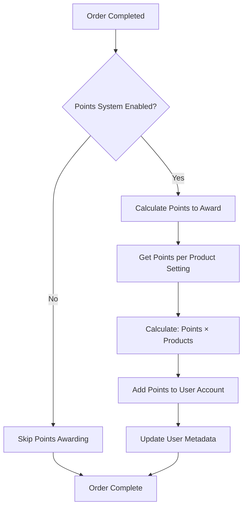
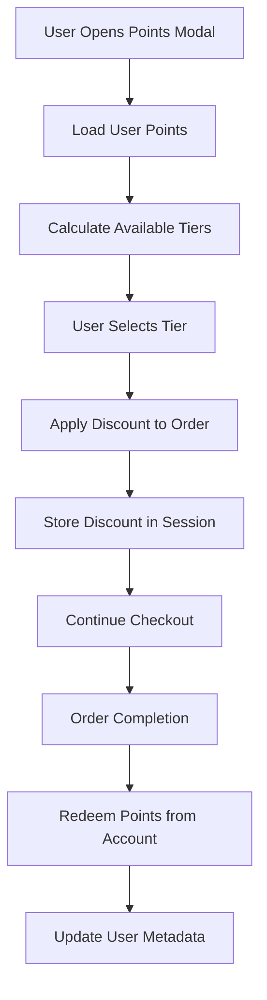

# Points System Documentation

## Overview

The Points System is a loyalty program that allows customers to earn points for purchases and redeem them for discounts. The system is tenant-specific and can be enabled/disabled per tenant.

## Features

### 🎯 **Core Functionality**
- **Earn Points**: Users earn points for each product purchased
- **Redeem Points**: Users can redeem points for percentage-based discounts
- **Multi-tenant Support**: Each tenant can have different points configurations
- **Real-time Updates**: Points are updated immediately after orders
- **Session Persistence**: Points discounts persist across checkout sessions

### 🏆 **Discount Tiers**
The system offers 5 discount tiers based on points accumulation:

| Tier | Points Required | Discount | Example (100 points per product) |
|------|----------------|----------|----------------------------------|
| 1    | 100 points     | 10% OFF  | 1 product purchase               |
| 2    | 200 points     | 15% OFF  | 2 product purchases              |
| 3    | 300 points     | 20% OFF  | 3 product purchases              |
| 4    | 400 points     | 25% OFF  | 4 product purchases              |
| 5    | 500 points     | 30% OFF  | 5 product purchases              |

## Architecture

### 📊 **Database Schema**

#### Profiles Table (User Points Storage)
```sql
-- Points are stored in the metadata JSONB column
metadata: {
  "points": 150,           -- Current available points
  "redeemedPoints": 50     -- Total points ever redeemed
}
```

#### Settings Table (Points Configuration)
```sql
-- Points per product setting
product_points: INTEGER DEFAULT 1  -- Points awarded per product purchased
```

### 🔧 **Key Components**

#### 1. **Points Service** (`src/integrations/supabase/profiles.service.ts`)
```typescript
// Get user's current points
getUserPoints(userId: string, tenantId: string): Promise<{ points: number; redeemedPoints: number }>

// Add points to user account
addUserPoints(userId: string, tenantId: string, pointsToAdd: number): Promise<boolean>

// Redeem points for discount
redeemUserPoints(userId: string, tenantId: string, pointsToRedeem: number): Promise<boolean>
```

#### 2. **Settings Service** (`src/integrations/supabase/settings.service.ts`)
```typescript
// Get points per product setting
getProductPoints(tenantId?: string): Promise<number>

// Update points per product setting
updateProductPoints(productPoints: number, tenantId?: string): Promise<boolean>
```

#### 3. **Points Hook** (`src/hooks/usePoints.ts`)
```typescript
// React hook for managing points state
const { points, redeemedPoints, loading, error, refetch } = usePoints();
```

#### 4. **Points Display Component** (`src/components/ui/points-display.tsx`)
```typescript
// Displays user's current points
<PointsDisplay points={points} redeemedPoints={redeemedPoints} />
```

#### 5. **Points Discount Modal** (`src/components/checkout/PointsDiscountModal.tsx`)
```typescript
// Modal for selecting discount tier
<PointsDiscountModal 
  isOpen={isOpen}
  onClose={onClose}
  onApplyDiscount={handleApplyDiscount}
  subtotal={subtotal}
/>
```

## Configuration

### 🏢 **Tenant Configuration**

Each tenant can enable/disable the points system:

```typescript
// In src/lib/tenants.ts
{
  id: "hoodti",
  name: "Hoodti",
  // ... other config
  pointsSystem: true,  // Enable points system
}
```

### ⚙️ **Admin Settings**

Admins can configure:
- **Points per Product**: How many points users earn per product purchased
- **System Enable/Disable**: Turn the entire points system on/off

## User Experience

### 🛒 **Earning Points**

1. **Purchase Products**: Users automatically earn points when they complete an order
2. **Points Calculation**: `Total Points = Points per Product × Number of Products`
3. **Immediate Credit**: Points are added to user account immediately after order completion

### 💰 **Redeeming Points**

1. **Access Modal**: Users click "Use Points" button in checkout
2. **Select Tier**: Choose from available discount tiers based on points balance
3. **Apply Discount**: Selected discount is applied to order total
4. **Points Deduction**: Points are deducted from user account upon order completion

### 📱 **UI Components**

#### Points Display
- Shows current points balance
- Displays total redeemed points
- Updates in real-time

#### Discount Modal
- Lists available discount tiers
- Shows points required and discount percentage
- Displays potential savings amount
- Prevents selection of unavailable tiers

## Technical Implementation

### 🔄 **Points Awarding Flow**



### 💸 **Points Redemption Flow**



### 🗄️ **Data Storage**

#### User Points (in profiles.metadata)
```json
{
  "points": 250,           // Available points
  "redeemedPoints": 100    // Lifetime redeemed points
}
```

#### Session Storage (Checkout)
```json
{
  "pointsDiscountInfo": {
    "amount": 15.00,       // Discount amount in currency
    "pointsUsed": 200,     // Points redeemed
    "discountPercent": 15  // Discount percentage
  }
}
```

## API Endpoints

### 📡 **Points Management**

#### Get User Points
```typescript
GET /api/profiles/{userId}/points
Response: { points: number, redeemedPoints: number }
```

#### Add Points
```typescript
POST /api/profiles/{userId}/points
Body: { pointsToAdd: number }
Response: { success: boolean }
```

#### Redeem Points
```typescript
POST /api/profiles/{userId}/points/redeem
Body: { pointsToRedeem: number }
Response: { success: boolean }
```

### ⚙️ **Settings Management**

#### Get Product Points Setting
```typescript
GET /api/settings/product-points
Response: { productPoints: number }
```

#### Update Product Points Setting
```typescript
PUT /api/settings/product-points
Body: { productPoints: number }
Response: { success: boolean }
```

## Security & Validation

### 🔒 **Security Measures**

1. **Tenant Isolation**: Points are scoped to specific tenants
2. **User Authentication**: All points operations require valid user authentication
3. **Input Validation**: Points values are validated before processing
4. **Transaction Safety**: Points operations are atomic to prevent race conditions

### ✅ **Validation Rules**

- **Minimum Points**: Users cannot redeem more points than they have
- **Positive Values**: Points must be positive integers
- **Tenant Scope**: Points operations are limited to user's current tenant
- **Order Completion**: Points are only awarded after successful order completion

## Error Handling

### 🚨 **Common Error Scenarios**

1. **Insufficient Points**: User tries to redeem more points than available
2. **System Disabled**: Points system is disabled for the tenant
3. **Network Errors**: API calls fail during points operations
4. **Invalid Configuration**: Points per product setting is invalid

### 🔧 **Error Recovery**

- **Graceful Degradation**: Checkout continues even if points operations fail
- **User Feedback**: Clear error messages for all failure scenarios
- **Retry Logic**: Automatic retry for transient network errors
- **Fallback Values**: Default to safe values when configuration is missing

## Performance Considerations

### ⚡ **Optimization Strategies**

1. **Lazy Loading**: Points data is loaded only when needed
2. **Caching**: User points are cached in React state
3. **Batch Operations**: Multiple points operations are batched when possible
4. **Database Indexing**: Proper indexes on user_id and tenant_id columns

### 📊 **Monitoring**

- **Points Awarded**: Track total points awarded per tenant
- **Redemption Rate**: Monitor points redemption frequency
- **User Engagement**: Measure points system usage
- **Error Rates**: Track points operation failures

## Migration & Setup

### 🚀 **Initial Setup**

1. **Enable Points System**: Set `pointsSystem: true` in tenant configuration
2. **Configure Points per Product**: Set default points per product in settings
3. **Run Migrations**: Ensure database schema is up to date
4. **Test Functionality**: Verify points earning and redemption work correctly

### 📦 **Database Migrations**

```sql
-- Add product_points column to settings table
ALTER TABLE settings ADD COLUMN IF NOT EXISTS product_points INTEGER DEFAULT 1;

-- Ensure profiles table has metadata column for points storage
-- (Already exists in most setups)
```

## Troubleshooting

### 🔍 **Common Issues**

#### Points Not Awarded
- Check if points system is enabled for tenant
- Verify points per product setting is configured
- Ensure order completion is successful
- Check for errors in points service logs

#### Points Not Redeemable
- Verify user has sufficient points balance
- Check if discount tiers are calculated correctly
- Ensure points modal is loading user data
- Verify session storage is working

#### UI Not Updating
- Check if usePoints hook is properly connected
- Verify points data is being fetched correctly
- Ensure React state updates are working
- Check for JavaScript errors in console

### 🛠️ **Debug Tools**

1. **Browser DevTools**: Check session storage and network requests
2. **Database Queries**: Direct database inspection of user metadata
3. **Console Logs**: Points operations are logged for debugging
4. **React DevTools**: Inspect component state and props

## Future Enhancements

### 🚀 **Planned Features**

1. **Points Expiration**: Add expiration dates for earned points
2. **Bonus Points**: Special events that award extra points
3. **Points History**: Detailed transaction history for users
4. **Referral Points**: Points for referring new customers
5. **Tier Benefits**: Additional benefits for high-tier users
6. **Points Transfer**: Allow users to transfer points to others
7. **Gift Cards**: Convert points to gift card balances

### 📈 **Analytics & Reporting**

1. **Points Analytics Dashboard**: Admin interface for points metrics
2. **User Engagement Reports**: Track points system usage
3. **Redemption Analytics**: Analyze discount tier preferences
4. **Revenue Impact**: Measure points system's effect on sales

## Support & Maintenance

### 📞 **Support Contacts**

- **Technical Issues**: Check logs and error messages first
- **Configuration Help**: Refer to tenant configuration documentation
- **Database Issues**: Contact database administrator
- **UI Problems**: Check React component state and props

### 🔄 **Maintenance Tasks**

1. **Regular Monitoring**: Check points system health daily
2. **Data Cleanup**: Remove expired or invalid points data
3. **Performance Tuning**: Optimize database queries as needed
4. **Security Updates**: Keep authentication and validation up to date

---

*Last Updated: January 2025*
*Version: 1.0.0*
